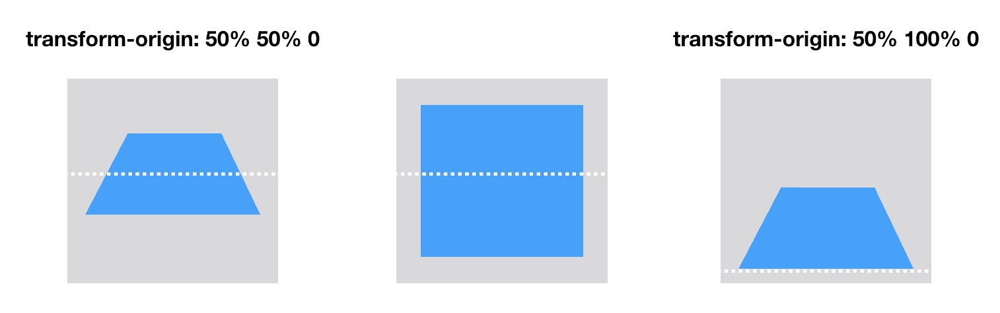

# CODE SPITZ 76 - CSS RENDERING
> TRANSFORM 3D

## POST PROCESS
- geometry -> fragment: 완성된 픽셀
- post process: 완성된 픽셀값을 변형시킬 수 있다.
- ex) transform, animation...


### - BUFFER
- 계산한 값을 메모리에 저장해두고, 그 이후에 그림을 그린다.

- cpu가 만든(geometry -> fragment) 이미지(buffer)를 GPU에 올려줘야 그린다. (post process)
  - 참고: 비트맵 데이터는 무겁다.

## TRANSFORM 3D
### 1. perspective (원근)

- perspective: 600px (600px만큼 떨어져있다)
- 가까워지면 왜곡이 많아진다.
### 2. perspective-origin

```css
@keyframes origin{
    0%{perspective-origin:0% 50%}
    50%{perspective-origin:100% 50%}
    100%{perspective-origin:0% 50%}
}

@keyframes spin{
    100%{transform:rotateX(360deg)}
}
html, body{height:100%;}
body{perspective:600px;background:#404040;animation:origin 10s linear infinite}
.test{
    width:500px;height:500px;background:#aaa;;
    position:absolute;left:50%;top:50%;margin-left:-250px;margin-top:-250px;
    animation:spin 30s linear infinite;
}
```
> - [코드 링크](https://jsfiddle.net/seungmikim/vpwg0L7b/1/)
> - [animation](https://developer.mozilla.org/ko/docs/Web/CSS/CSS_Animations/Using_CSS_animations)
> - [animation2](https://developer.mozilla.org/ko/docs/Web/CSS/animation)
> - [keyframs](https://developer.mozilla.org/ko/docs/Web/CSS/@keyframes)
> - [perspective-origin](https://developer.mozilla.org/en-US/docs/Web/CSS/perspective-origin)
> - [transform](https://developer.mozilla.org/ko/docs/Web/CSS/transform#rotatex())
> - [CSS Animation - Can I use](https://caniuse.com/css-animation)
- **animation**: name duration timing-funnction delay iteration-count
- **perspective-origin**: x-position y-position
### 3. transform-style

- 부모의 회전에 맞춰서 자식도 같이 회전
> - [transform-style](https://developer.mozilla.org/en-US/docs/Web/CSS/transform-style)
### 4. transform-origin
- 변형의 기준

> - [tranform-origin](https://developer.mozilla.org/en-US/docs/Web/CSS/transform-origin)
> - [코드 링크](https://jsfiddle.net/seungmikim/vpwg0L7b/10/)
- One-value syntax: left, center, right, top
- Two-value syntax: left, center, right / top, center, bottom (순서 무관)
- Three-value syntax: Two-value syntax + length

### 5. backface-visibility
- 보이지 않는, 뒤도 그린다. (부하)
```css
backface-visibility: hidden;
```
> - [코드 링크](https://jsfiddle.net/seungmikim/vpwg0L7b/3/)

> GPU로 분산시키기 위해, 일부러 ```rotateX: 0```을 주기도..

## MAKE DRUM


### JS MIX

- [css sprite](https://www.w3schools.com/css/css_image_sprites.asp)
> 이미지를 한번만 불러서, 한꺼번에 뜨는 효과
> - [cssText](https://developer.mozilla.org/en-US/docs/Web/API/CSSStyleDeclaration/cssText)
> - [translat3d](https://developer.mozilla.org/en-US/docs/Web/CSS/transform-function/translate3d())
> - [angle](https://developer.mozilla.org/ko/docs/Web/CSS/angle)


> - [참고](https://ktpark1651.tistory.com/208)
> - [코드링크](https://jsfiddle.net/seungmikim/vpwg0L7b/136/)